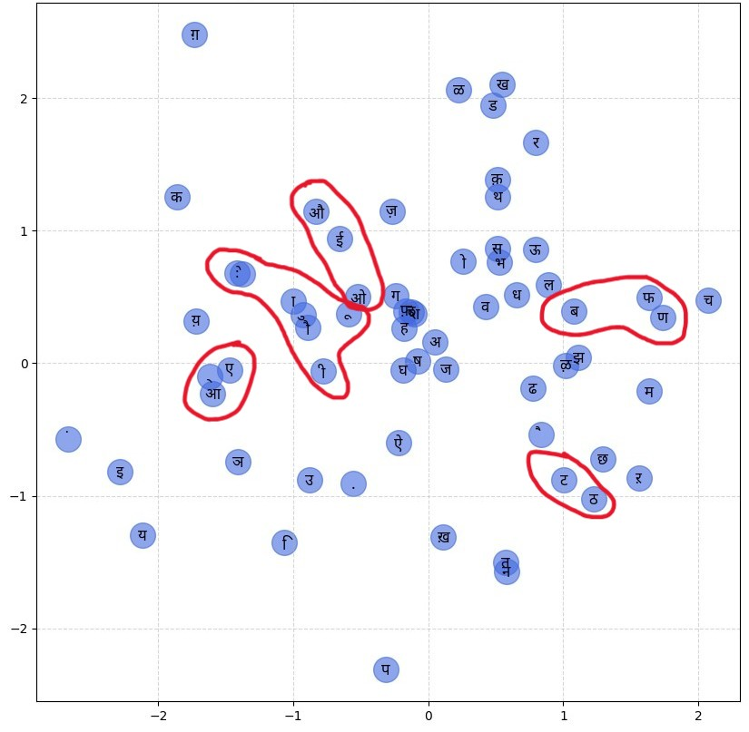

# AksharLM
A character-level Hindi language model built from scratch in PyTorch using manual backpropagation and custom character embeddings.

## Overview
AksharLM is a neural network that learns to generate Hindi-style words by predicting one character at a time.  
The model was implemented **from scratch**, including **manual gradient calculations**, without using PyTorch’s automatic backpropagation.

## Embedding Visualization
<p align="center">
  
</p>

### Embedding Interpretation
The highlighted clusters show that the model has learned **phonetic and contextual similarities** between characters.

- Characters that **sound similar** or belong to the same phonetic group appear close together.
- For example, letters like **ब, प, फ** (labial sounds) form a cluster.
- Similarly, **ट, ठ, ड** (retroflex sounds) are grouped together.
- Vowel-related characters also appear near each other.

This indicates that the model is not memorizing characters randomly.  
Instead, it is learning **meaningful relationships** based on how characters appear in Hindi words.

This project demonstrates:
- Character embeddings
- Manual backpropagation
- Batch normalization
- Training a neural network from scratch

## Model Details
- Character-level language model
- Trained on a Hindi text dataset
- Embedding + MLP architecture
- Manual backpropagation (no autograd for training)
- Implemented in PyTorch

## Training Setup

- **Platform:** Google Colab  
- **GPU:** NVIDIA T4  
- **Framework:** PyTorch

## Training Results
Final losses: 
```python
Step = 200000
Training_Loss = 2.0504837036132812
Validation_Loss = 2.0489163398742676
```

## Sample Generated Words
Examples generated by the model:
```
ऱाशिरजन्.
णैव्श्.
छशन्कल्न.
छिदुशिनि.
आएनि.
डिनन्.
ऊषन्गोनि.
ज़स्रिथन्.
ःएअयह्.
ऱमत्.
ख़निनि.
आअथिज्वित्.
ऱश्मिथ.
आवश्वि.
ऊघ्लन.
ख़ार्नथि.
ख़लेरन्च्य.
ख़िलिनि.
ऱविथ्य.
णागेन्थ्.
```

## Key Learning Goals
This project was built to:
- Understand neural networks at a low level
- Implement backpropagation manually
- Learn character embeddings
- Train a language model from scratch

## Tech Stack
- Python
- PyTorch
- Matplotlib
- Google Colab
